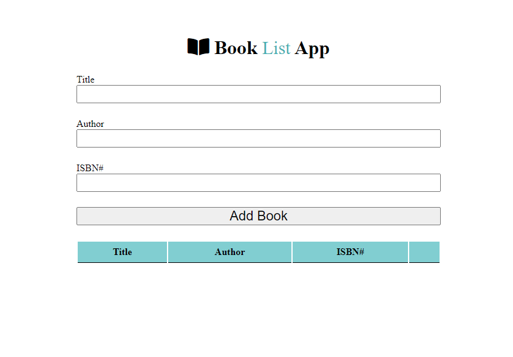

# booklist-with-classes-app

# [JavaScript-BookList-App](https://lastnamearya.github.io/JavaScript-BookList-App/)
It's a simple app which I built in pure Vanilla.js without using any library like jQuery. I built this after learning Object-Oriented Programming in Js. I also implemented browser's LocalStorage API in my app.

<!--
*** Thanks for checking out the Best-README-Template. If you have a suggestion
*** that would make this better, please fork the repo and create a pull request
*** or simply open an issue with the tag "enhancement".
*** Thanks again! Now go create something AMAZING! :D
-->

<!-- PROJECT SHIELDS -->
<!--
*** I'm using markdown "reference style" links for readability.
*** Reference links are enclosed in brackets [ ] instead of parentheses ( ).
*** See the bottom of this document for the declaration of the reference variables
*** for contributors-url, forks-url, etc. This is an optional, concise syntax you may use.
*** https://www.markdownguide.org/basic-syntax/#reference-style-links
-->

[![Contributors][contributors-shield]][contributors-url]
[![Forks][forks-shield]][forks-url]
[![Issues][issues-shield]][issues-url]
[![MIT License][license-shield]][license-url]
[![LinkedIn][linkedin-shield]][linkedin-url]

<!-- TABLE OF CONTENTS -->

  
Table of Contents

  <ol>
    <li>
      <a href="#about-the-project">About The Project</a>
      <ul>
        <li><a href="#built-with">Built With</a></li>
      </ul>
    </li>
    <li><a href="#contact">Contact</a></li>
  </ol>

<!-- ABOUT THE PROJECT -->
## About The Project

#### JavaScript Used

* DOM Manipulation
* JavaScript CSS Manipulation
* Css Animations
* addEventListener

Created using JavaScript with the following features:

- A simple quiz with radio button choices, that shows the quiz taker their score upon completion.
- The quiz can show any number of questions but only four choices.
- Tally the user’s score and display the final score on the last page. The last page will only show the score.
- Use an array to store all the questions. Each question, along with its choices and correct answer, should be stored in an object.
- Dynamically remove the current question and go to the next question, when the user clicks the “Next” button.
- A “Back” button that allows the user to go to the previous question and change their answer. The user can go back up to the first question.

### Built With
* [Javascipt](https://www.javascript.com/)
* [HTML](https://html.com/)
* [CSS](https://css.com/)

<!-- CONTACT -->
## Contact

Furkan Çat - [@FurkanCat](https://twitter.com/FurkanCat) - furi544@gmail.com

Project Link: [Project Link](https://github.com/InsomniumFerum/Quiz-app)

<!-- MARKDOWN LINKS & IMAGES -->
<!-- https://www.markdownguide.org/basic-syntax/#reference-style-links -->
[contributors-shield]: https://img.shields.io/github/contributors/InsomniumFerum/Best-README-Template.svg?style=for-the-badge
[contributors-url]: https://github.com/InsomniumFerum/Best-README-Template/graphs/contributors
[forks-shield]: https://img.shields.io/github/forks/InsomniumFerum/Best-README-Template.svg?style=for-the-badge
[forks-url]: https://github.com/InsomniumFerum/Best-README-Template/network/members
[stars-shield]: https://img.shields.io/github/stars/InsomniumFerum/Best-README-Template.svg?style=for-the-badge
[stars-url]: https://github.com/InsomniumFerum/Best-README-Template/stargazers
[issues-shield]: https://img.shields.io/github/issues/InsomniumFerum/Best-README-Template.svg?style=for-the-badge
[issues-url]: https://github.com/InsomniumFerum/Best-README-Template/issues
[license-shield]: https://img.shields.io/github/license/InsomniumFerum/Best-README-Template.svg?style=for-the-badge
[license-url]: https://github.com/InsomniumFerum/Best-README-Template/blob/master/LICENSE.txt
[linkedin-shield]: https://img.shields.io/badge/-LinkedIn-black.svg?style=for-the-badge&logo=linkedin&colorB=555
[linkedin-url]: https://www.linkedin.com/in/furkan-%C3%A7at-20174216/
[product-screenshot]: images/project.png
